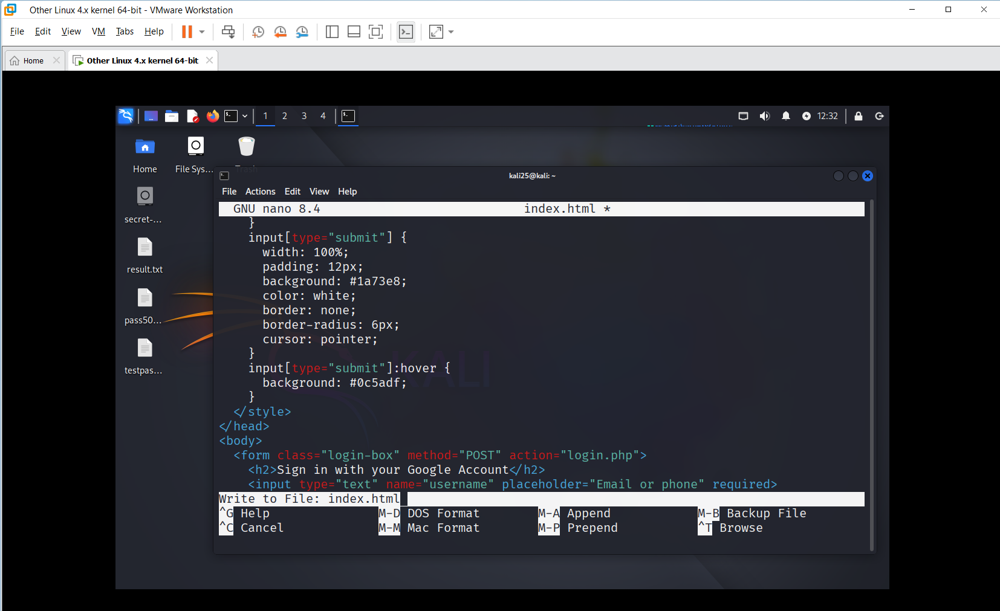
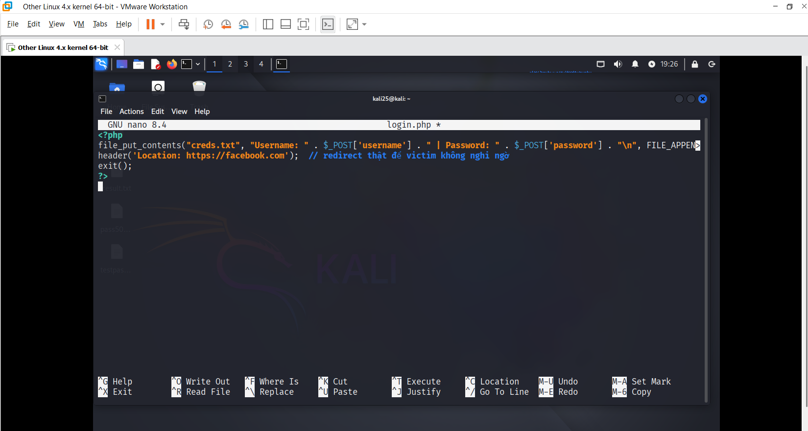
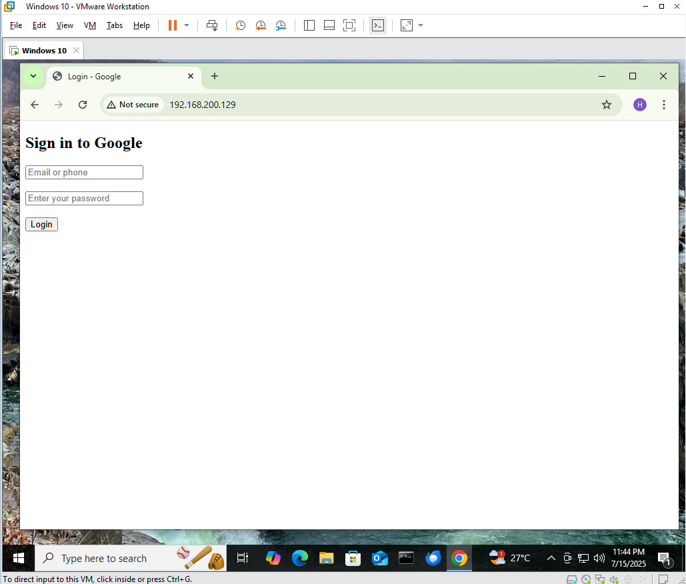

---

# 🧪 Mô phỏng DNS Spoofing + Phishing

## 💡 Mục tiêu

Mô phỏng tấn công DNS spoofing kết hợp phishing để thu thập tài khoản người dùng trong môi trường nội bộ.

---

## 🛠️ Môi trường

| Thành phần | Hệ điều hành | Mục đích |
|------------|--------------|----------|
| **Attacker** | Kali Linux | Dựng web giả + DNS spoof |
| **Victim**   | Windows 10  | Truy cập và bị redirect |
| **Công cụ** | Apache2, PHP, Bettercap | |

---

## 🔨 Bước 1: Dựng Web Giả

Tạo file `index.html` và `login.php` để hiển thị form giả và ghi lại tài khoản + mật khẩu nhập vào.

### 🖼️ Cấu trúc thư mục `/var/www/html/`


```
├── index.html   -> form login
├── login.php    -> ghi lại thông tin user
└── creds.txt (sẽ được tạo sau khi user login)
```
### 🖼️ Tạo file index.html



### 🖼️ Tạo file login.php




## 🔨 Bước 2: Test form
🔧 1. Đảm bảo Apache đang chạy             ```  sudo service apache2 start```.

🌐 2. Truy cập form từ trình duyệt         ``` http://192.168.200.129``` 

🖱️ 3. Nhập thử tài khoản



📁 4. Kiểm tra file log         ```cat /var/www/html/creds.txt```


