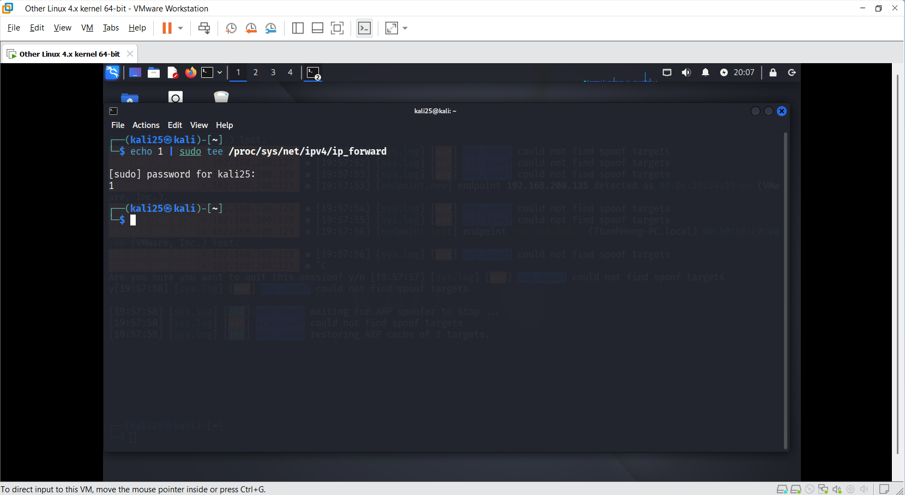
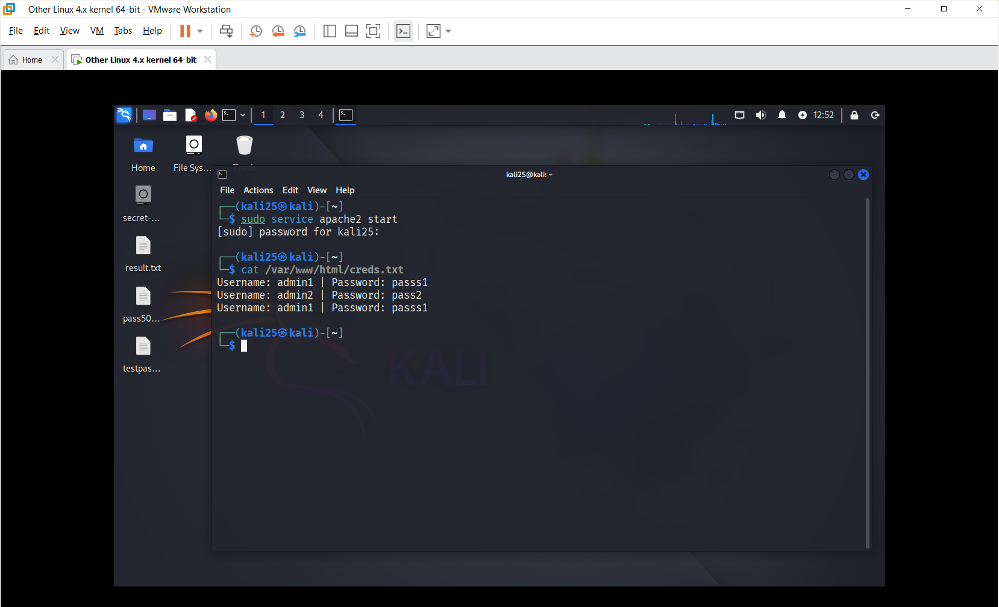
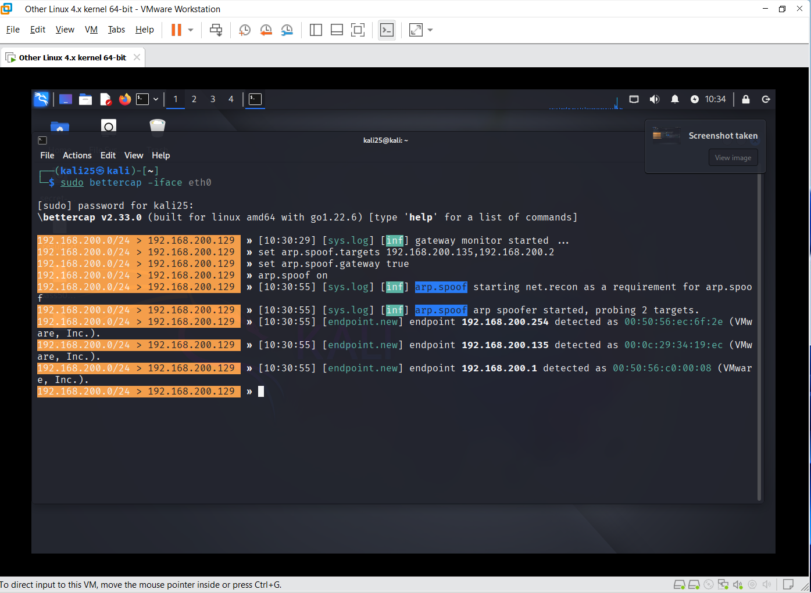
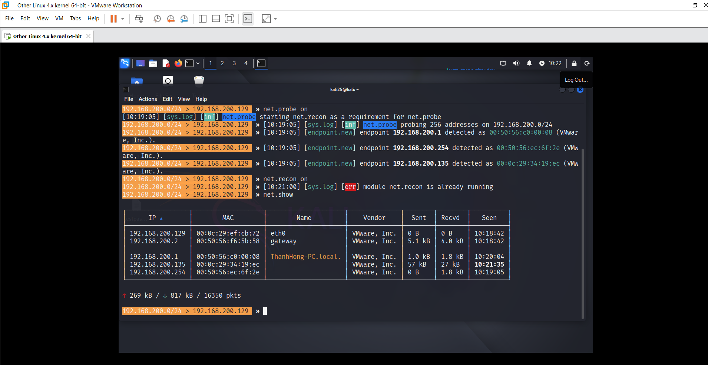
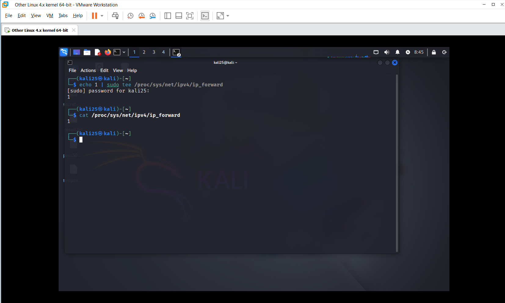

---

# 🧪 Mô phỏng Phishing Website | ARP spoofing | DNS spoofing

## 💡 Mục tiêu

Mô phỏng tấn công DNS spoofing kết hợp phishing để thu thập tài khoản người dùng trong môi trường nội bộ.

---

## 🛠️ Môi trường

| Thành phần | Hệ điều hành | Mục đích |
|------------|--------------|----------|
| **Attacker** | Kali Linux | Dựng web giả + DNS spoof |
| **Victim**   | Windows 10  | Truy cập và bị redirect |
| **Công cụ** | Apache2, PHP, Bettercap | |

---

## 🔨 Bước 1: Dựng Web Giả

Tạo file `index.html` và `login.php` để hiển thị form giả và ghi lại tài khoản + mật khẩu nhập vào.

### 🖼️ Cấu trúc thư mục `/var/www/html/`


```
├── index.html   -> form login
├── login.php    -> ghi lại thông tin user
└── creds.txt (sẽ được tạo sau khi user login)
```
### 🖼️ Tạo file index.html


### 🖼️ Tạo file login.php


### 🖼️ Tạo lại file rỗng creds.txt

```sudo touch /var/www/html/creds.txt```

### 🖼️ Cấp quyền ghi cho web server (để login.php ghi dữ liệu)

```sudo chmod 666 /var/www/html/creds.txt```

### 🖼️ Bật IP_forwarding



# Mục đích: Để các gói tin từ Victim -> chuyển được sang Gateway.

## 🔨 Bước 2: Test form
🔧 1. Đảm bảo Apache đang chạy             ```  sudo service apache2 start```.

🌐 2. Truy cập form từ trình duyệt         ``` http://192.168.200.129``` 

🖱️ 3. Nhập thử tài khoản


📁 4. Kiểm tra file log         ```cat /var/www/html/creds.txt```



# KẾT QUẢ

Submit form không báo lỗi

Tự động redirect về ```https://accounts.google.com```

File ```creds.txt``` xuất hiện và chứa dòng như trên

# 🧪 Mô phỏng ARP Spoofing
## 💡 Mục tiêu
 BƯỚC 1: Khởi động ```bettercap```
 
```set arp.spoof.targets 192.168.200.135,192.168.200.2 ```  

- Giả mạo ARP với cả 2 thiết bị này -> khiến chúng đều tin rằng attacker là người còn lại → attacker sẽ chen giữa

```set arp.spoof.gateway true ```

- Dùng địa chỉ MAC của máy thật để gửi gói đến gateway (tránh gây DoS).

- Tạo spoof 2 chiều an toàn hơn giữa victim và router.

```arp.spoof on ```

- Gửi ARP giả liên tục -> Victim & Router
  
- Lừa cả 2 thiết bị update ARP table sai lệch, trỏ MAC attacker vào IP của nhau.

- Kết quả: toàn bộ traffic giữa victim và router đi qua attacker.




 BƯỚC 2: Quét mạng tìm Victim



# BẬT IP_FORWARDING


### Mục đích: Để các gói tin từ Victim -> chuyển được sang Gateway

💡 Sau khi bật IP forwarding
Gói tin từ Victim -> chuyển bình thường -> sẽ không còn ```endpoint.lost```

#  Mục tiêu của ARP Spoof 

- Giả mạo để chèn attacker vào giữa victim & router

- Thiết lập ARP table sai lệch ở victim & gateway

- Bật IP forwarding để gói tin đi qua attacker mà không bị gián đoạn

- Cho phép theo dõi hoặc điều hướng traffic của victim
